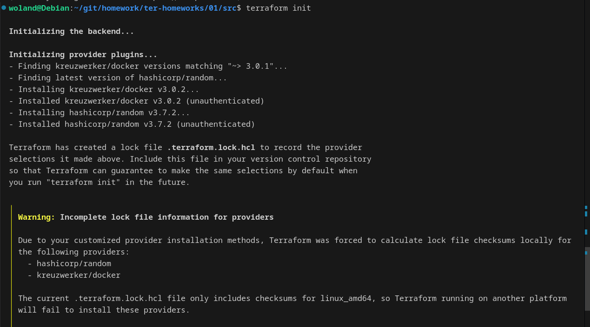
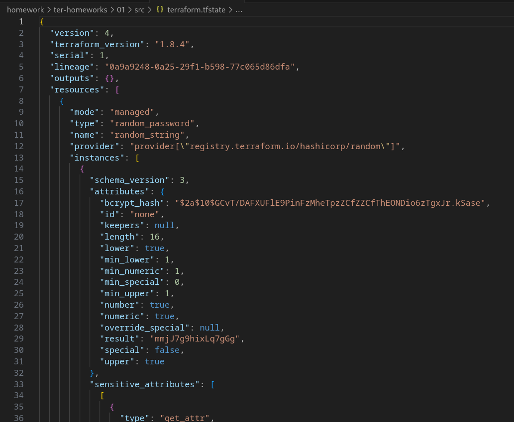
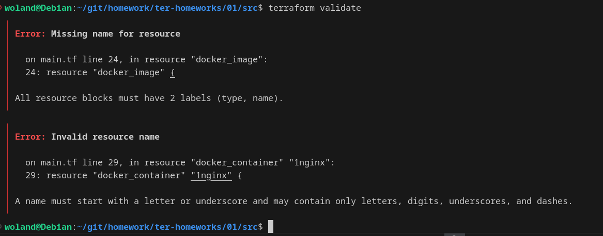
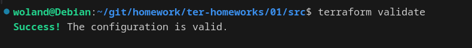
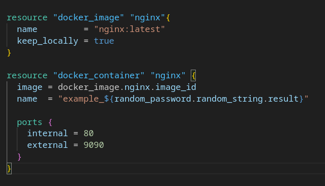
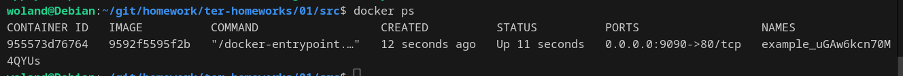
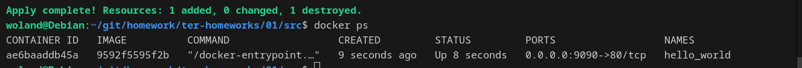
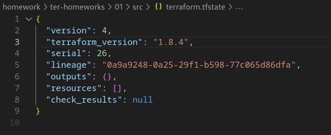
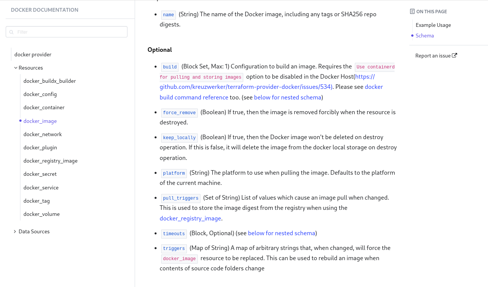

# Домашнее задание к занятию «Введение в Terraform» - Барышков Михаил

### Задание 1

1. Перейдите в каталог [**src**](https://github.com/netology-code/ter-homeworks/tree/main/01/src). Скачайте все необходимые зависимости, использованные в проекте. 
2. Изучите файл **.gitignore**. В каком terraform-файле, согласно этому .gitignore, допустимо сохранить личную, секретную информацию?(логины,пароли,ключи,токены итд)
3. Выполните код проекта. Найдите  в state-файле секретное содержимое созданного ресурса **random_password**, пришлите в качестве ответа конкретный ключ и его значение.
4. Раскомментируйте блок кода, примерно расположенный на строчках 29–42 файла **main.tf**.
Выполните команду ```terraform validate```. Объясните, в чём заключаются намеренно допущенные ошибки. Исправьте их.
5. Выполните код. В качестве ответа приложите: исправленный фрагмент кода и вывод команды ```docker ps```.
6. Замените имя docker-контейнера в блоке кода на ```hello_world```. Не перепутайте имя контейнера и имя образа. Мы всё ещё продолжаем использовать name = "nginx:latest". Выполните команду ```terraform apply -auto-approve```.
Объясните своими словами, в чём может быть опасность применения ключа  ```-auto-approve```. Догадайтесь или нагуглите зачем может пригодиться данный ключ? В качестве ответа дополнительно приложите вывод команды ```docker ps```.
8. Уничтожьте созданные ресурсы с помощью **terraform**. Убедитесь, что все ресурсы удалены. Приложите содержимое файла **terraform.tfstate**. 
9. Объясните, почему при этом не был удалён docker-образ **nginx:latest**. Ответ **ОБЯЗАТЕЛЬНО НАЙДИТЕ В ПРЕДОСТАВЛЕННОМ КОДЕ**, а затем **ОБЯЗАТЕЛЬНО ПОДКРЕПИТЕ** строчкой из документации [**terraform провайдера docker**](https://docs.comcloud.xyz/providers/kreuzwerker/docker/latest/docs).  (ищите в классификаторе resource docker_image )


------

## Решение 1

1. 
2. допустимо сохранить личную, секретную информацию personal.auto.tfvars
3. 
4. 


❌ Ошибки: 

-  Неправильное имя ресурса random_password:

```text    
random_password.random_string_FAKE.resulT
```
 
- random_string_FAKE — такого экземпляра нет.

**Верное имя: random_password.random_string.**
     

-- Ошибка в имени атрибута:

**.resulT** → должно быть **.result** (чувствительно к регистру).
     

- Имя контейнера (1nginx):

Начинается с цифры. Terraform позволяет это, но это не рекомендуется , так как может вызвать проблемы при дальнейшем использовании (например, в выводах или зависимостях).

- Здесь вы указали только тип (docker_image), но забыли имя ресурса , например: "nginx"
```terraform
resource "docker_image" {
  name         = "nginx:latest"
  keep_locally = true
}
```



5. 

     
6. 
🛑 Почему опасно использовать -auto-approve? 

Команда terraform apply -auto-approve пропускает подтверждение действий , что может быть опасно , потому что: 

- Неверные изменения
	
- Terraform может удалить или изменить критичные ресурсы без вашего ведома.
Потеря данных
	
- Например, удаление БД без подтверждения.
Работа в production
	
- Особенно опасно применять в боевой среде без предварительного просмотра изменений (
plan
).



8. 


9. В main.tf есть следующий блок:

```terraform
resource "docker_image" "nginx" {
  name         = "nginx:latest"
  keep_locally = true
}
```

**keep_locally = true**

Этот параметр говорит Terraform не удалять образ локально , даже если сам ресурс docker_image будет уничтожен.

