# Домашнее задание к занятию «Использование Terraform в команде» - Барышков Михаил

## Задание 1

1. Возьмите код:
- из [ДЗ к лекции 4](https://github.com/netology-code/ter-homeworks/tree/main/04/src),
- из [демо к лекции 4](https://github.com/netology-code/ter-homeworks/tree/main/04/demonstration1).
2. Проверьте код с помощью tflint и checkov. Вам не нужно инициализировать этот проект.
3. Перечислите, какие **типы** ошибок обнаружены в проекте (без дублей).

## Решение 1

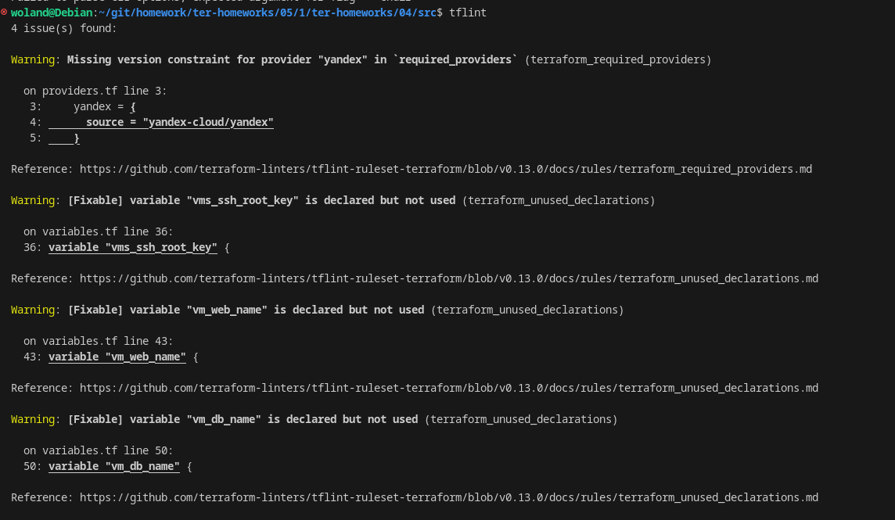

Вот подробное описание всех найденных предупреждений (warnings) от TFLint

1. Отсутствует ограничение версии провайдера "yandex"

Что означает:
В файле **providers.tf** в блоке **required_providers** указан провайдер yandex, но не указана версия (например, version = "~> 0.85"). Это может привести к неожиданным изменениям при обновлении провайдера — например, новая версия может сломать вашу инфраструктуру.

2. Переменная **vms_ssh_root_key** и **vm_web_name объявлена** и **vm_db_name**, но нигде не используется

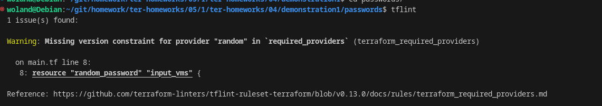

В конфигурации используется провайдер random (например, для генерации случайных паролей через random_password), но в блоке required_providers не указана версия этого провайдера. 

Где обнаружено:
Файл: main.tf, строка 8:

Проблема:
Если версия провайдера не зафиксирована, Terraform может автоматически загрузить самую новую версию при запуске init. Это рискованно, потому что новая версия может содержать breaking changes (изменения, ломающие совместимость), что приведёт к ошибкам в вашем коде.

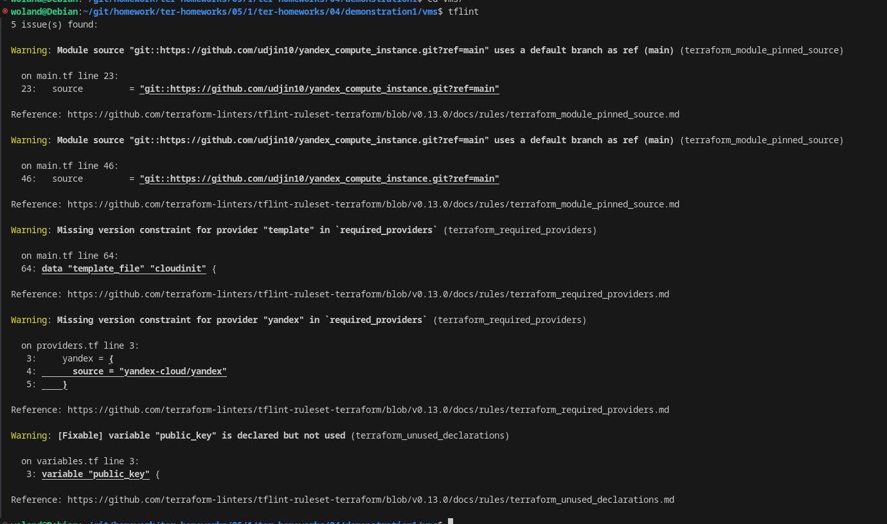

 1 и 2. Использование ветки по умолчанию (main) в ссылке на модуль — ненадёжная ссылка

 При этом используется ветка main — это небезопасно, потому что содержимое этой ветки может меняться со временем.
Если автор модуля внесёт критические изменения — ваш код может перестать работать. 

Где находится:   

    Строка 23: модуль для первой ВМ
    Строка 46: модуль для второй ВМ
     

Риск:
Нестабильность и непредсказуемость — сегодня работает, завтра сломается после terraform init. 

 3. Отсутствует ограничение версии провайдера "template"

 Что означает:
Вы используете ресурс data "template_file" (или аналогичный), который требует провайдер template, но не указали его версию в блоке required_providers. 

Где находится:
Файл main.tf, строка 64:

Без фиксации версии Terraform может загрузить несовместимую версию провайдера template, что приведёт к ошибкам.

**Остальныек ошибки повторяються** 

### Вот подробный перевод и объяснение результатов Checkov

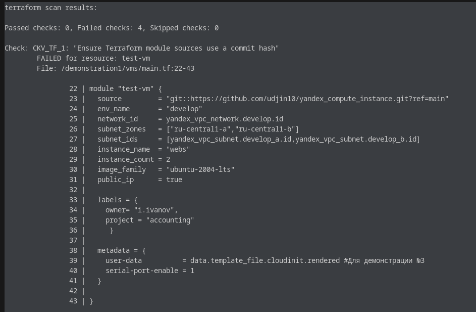
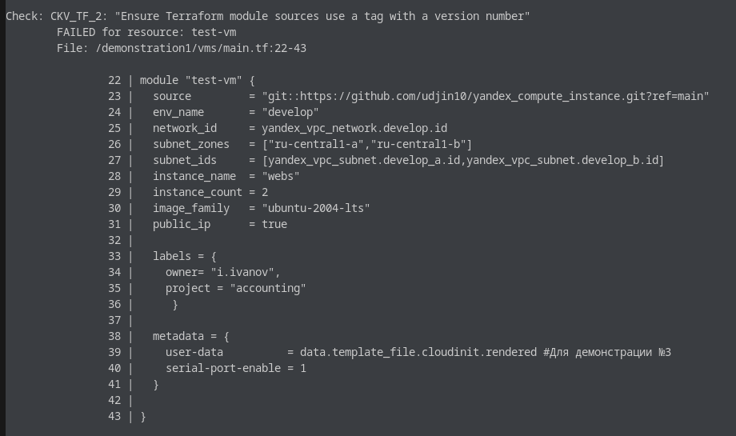
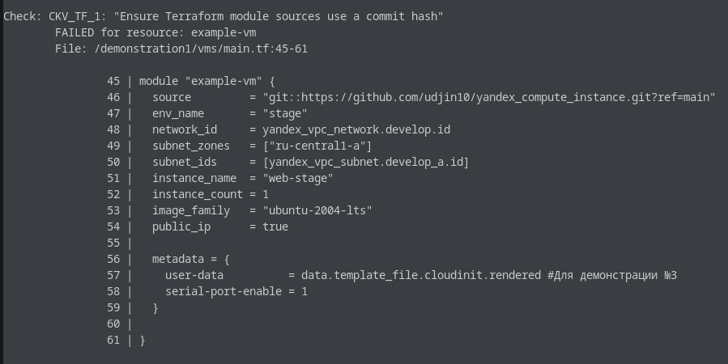
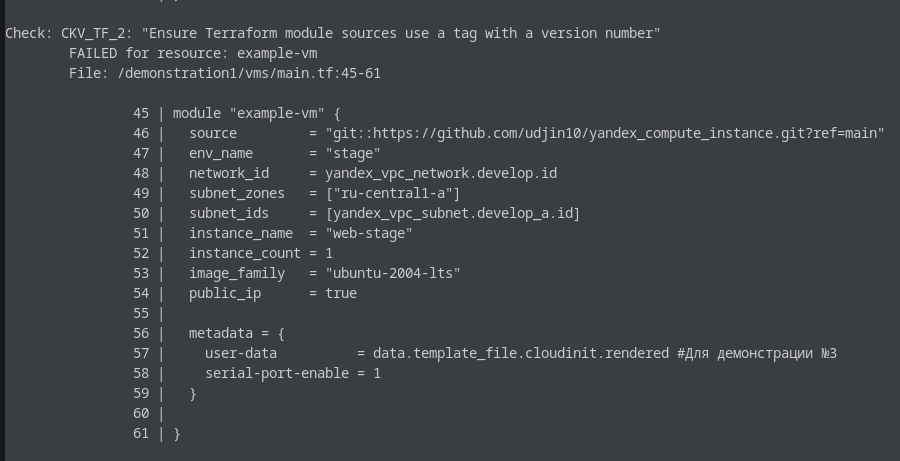
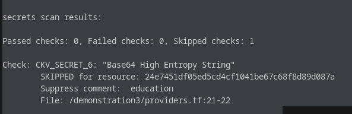

1. "Ensure Terraform module sources use a commit hash" (Убедитесь, что источник модуля Terraform использует хэш коммита)

Где найдено: 

    Модуль test-vm — строка 23:
    Модуль example-vm — строка 46:

Вы используете ветку main как ссылку (ref=main) для внешнего модуля. Это небезопасно, потому что: 

    Ветка main может меняться со временем.
    Кто-то может внести критические изменения в модуль — и ваш terraform apply сломается или начнёт создавать неожиданную инфраструктуру.
     

Риск:
Нестабильность, непредсказуемость, потенциальные ошибки при развертывании. 

2. Ensure Terraform module sources use a tag with a version number(Убедитесь, что источник модуля Terraform использует тег с номером версии)

Где найдено: 

    Те же два модуля: test-vm и example-vm
     
Почему важно:
Использование тегов (например, v1.2.0) гарантирует, что вы всегда используете стабильную и протестированную версию модуля.

3. Base64 High Entropy String(Строка в формате Base64 с высокой энтропией (возможный секрет) )

Где найдено:   

    Файл: demonstration3/providers.tf, строки 21–22
    Ресурс: 24e7451df05ed5cd4cf1041be67c68f8d89d087a (хэш)
     

Статус: SKIPPED (пропущено)

Причина пропуска: Suppress comment: education 

Что это значит:
Checkov обнаружил строку с высокой энтропией (похожую на секрет, например, токен или ключ), но не стал её считать уязвимостью, потому что: 

    Разработчик явно пометил это как ложное срабатывание.
    Комментарий // checkov:skip=CKV_SECRET_6:education говорит: "Это не секрет, это для обучения".

### Задание 2

1. Возьмите ваш GitHub-репозиторий с **выполненным ДЗ 4** в ветке 'terraform-04' и сделайте из него ветку 'terraform-05'.
2. Повторите демонстрацию лекции: настройте YDB, S3 bucket, yandex service account, права доступа и мигрируйте state проекта в S3 с блокировками. Предоставьте скриншоты процесса в качестве ответа.
3. Закоммитьте в ветку 'terraform-05' все изменения.
4. Откройте в проекте terraform console, а в другом окне из этой же директории попробуйте запустить terraform apply.
5. Пришлите ответ об ошибке доступа к state.
6. Принудительно разблокируйте state. Пришлите команду и вывод.

## Решение 2
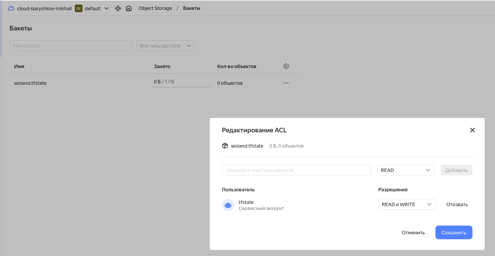
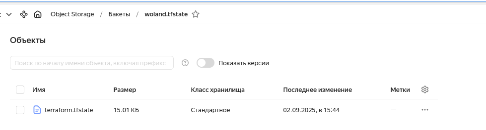
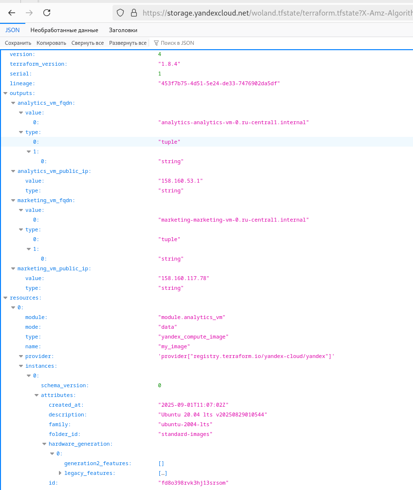
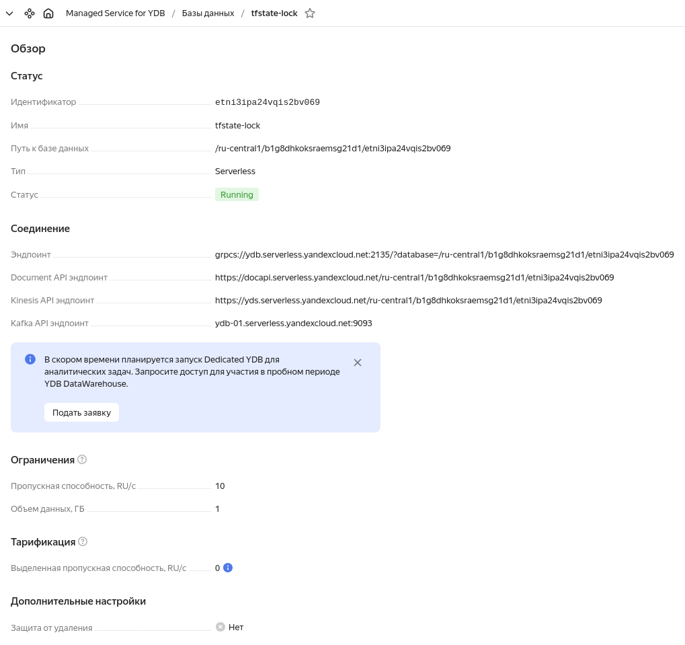
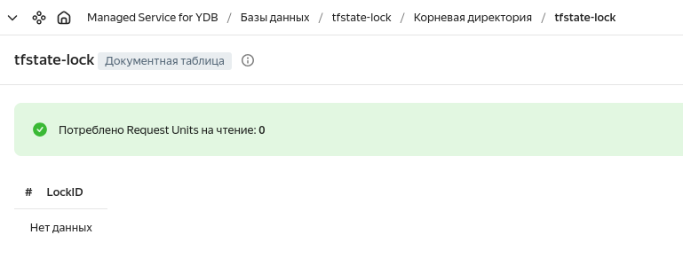
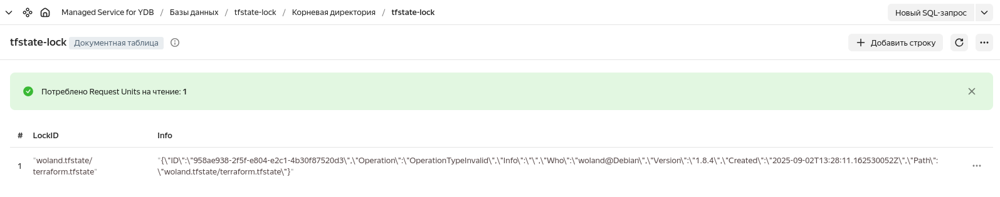
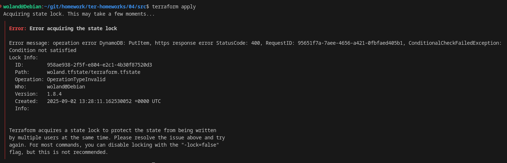
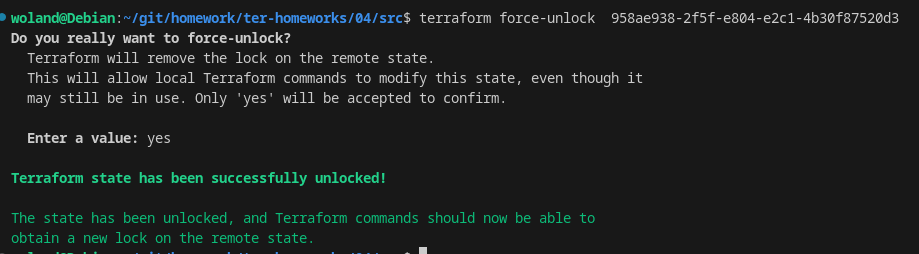

### Задание 3  

1. Сделайте в GitHub из ветки 'terraform-05' новую ветку 'terraform-hotfix'.
2. Проверье код с помощью tflint и checkov, исправьте все предупреждения и ошибки в 'terraform-hotfix', сделайте коммит.
3. Откройте новый pull request 'terraform-hotfix' --> 'terraform-05'. 
4. Вставьте в комментарий PR результат анализа tflint и checkov, план изменений инфраструктуры из вывода команды terraform plan.
5. Пришлите ссылку на PR для ревью. Вливать код в 'terraform-05' не нужно.

## Решение 3
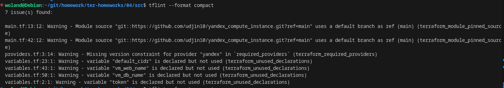
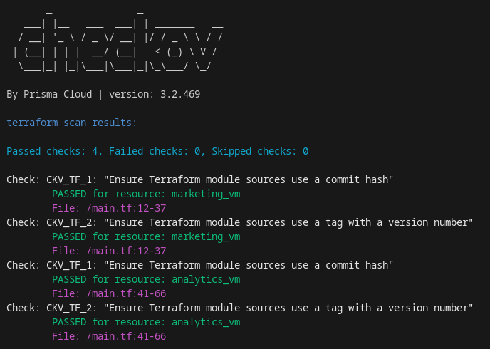

[Pull requests](https://github.com/BaryshkovMikhail/ter-homeworks/pull/1)