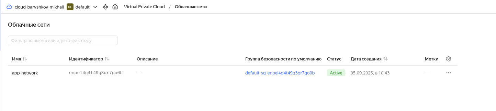
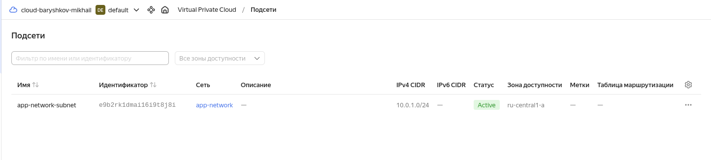
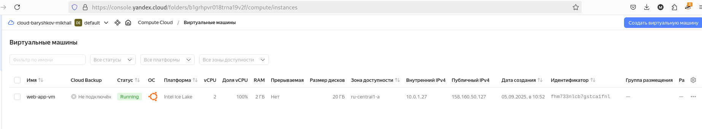
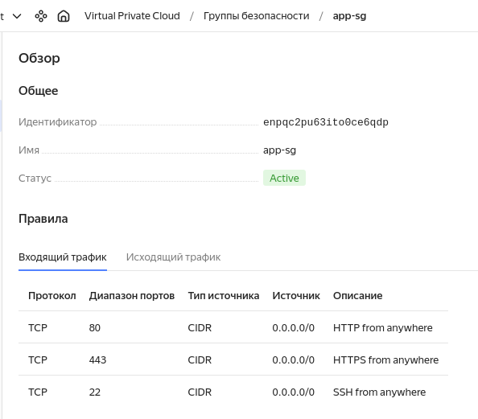
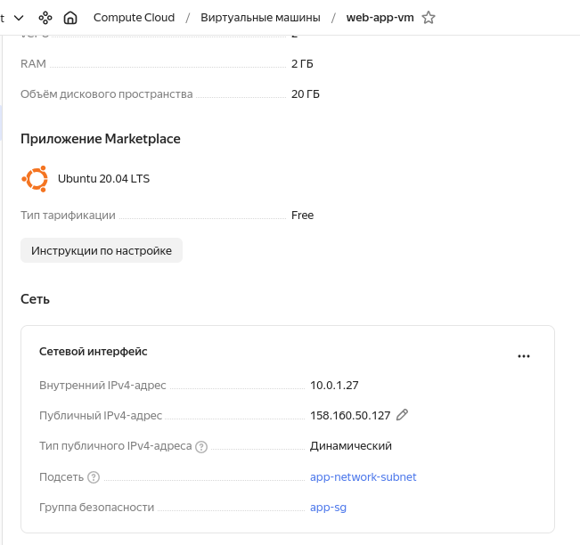
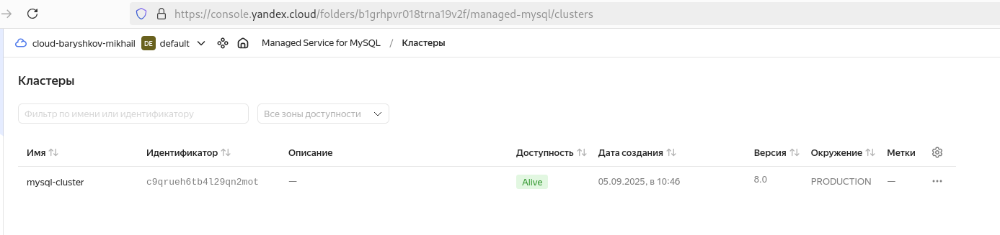
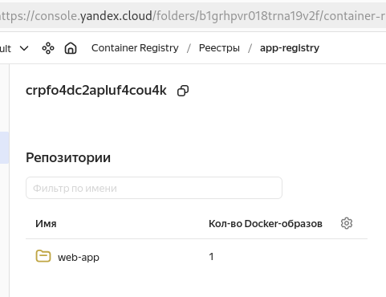
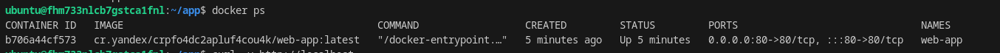

# Итоговый проект модуля «Облачная инфраструктура. Terraform» - <Барышков Михаил>

## Описание итогового проекта:

Задания итогового проекта охватывают полный цикл создания и настройки инфраструктуры, установку необходимых инструментов, сборку и развертывание приложения, а также хранение образов в реестре контейнеров.

## В рамках итогового проекта вы:

    Соберете простое web-приложение на основании представленных нами данных (с описанием Dockerfile, docker compose yml).
    Настроите инфраструктуру в Yandex Cloud, используя Terraform.
    Развернете приложение в облачной среде.
     

## Инструкция по выполнению итогового проекта:

Используя инструменты Docker, Docker Compose и Terraform, вам необходимо сделать следующее:
 

Задание 1. Развертывание инфраструктуры в Yandex Cloud.

    Создайте Virtual Private Cloud (VPC).
    Создайте подсети.
    Создайте виртуальные машины (VM):
        Настройте группы безопасности (порты 22, 80, 443).
        Привяжите группу безопасности к VM.
    Опишите создание БД MySQL в Yandex Cloud.
    Опишите создание Container Registry.
     

Задание 2. Используя user-data (cloud-init), установите Docker и Docker Compose (см. Задания 5 модуля «Виртуализация и контейнеризация»).

Задание 3. Опишите Docker файл (см. Задания 5 «Виртуализация и контейнеризация») c web-приложением и сохраните контейнер в Container Registry.

Задание 4. Завяжите работу приложения в контейнере на БД в Yandex Cloud.

Задание 5*. Положите пароли от БД в LockBox и настройте интеграцию с Terraform так, чтобы пароль для БД брался из LockBox.

## Решение 1
✔ Создана VPC
```
resource "yandex_vpc_network" "main" {
  name = var.vpc_name
}
```

✅ Развернута с помощью Terraform, имя задаётся через переменную.

✔ Созданы подсети

```
resource "yandex_vpc_subnet" "main" {
  name           = "${var.vpc_name}-subnet"
  zone           = var.default_zone
  network_id     = yandex_vpc_network.main.id
  v4_cidr_blocks = var.subnet_cidr
}
```


✅ Подсеть создана в зоне ru-central1-a, CIDR задаётся через переменную.

✔ Созданы виртуальные машины (VM)

```
resource "yandex_compute_instance" "app_vm" {
  name        = var.vm_name
  zone        = var.default_zone
  platform_id = var.platform_id
  resources   { ... }
  boot_disk   { ... }
  network_interface { ... }
}
```


✅ ВМ создана с настройками ресурсов через переменные.

✔ Настроена группа безопасности (порты 22, 80, 443)
```
variable "security_group_ingress" {
  default = [
    { protocol = "TCP", port = 22, v4_cidr_blocks = ["0.0.0.0/0"], description = "SSH" },
    { protocol = "TCP", port = 80, v4_cidr_blocks = ["0.0.0.0/0"], description = "HTTP" },
    { protocol = "TCP", port = 443, v4_cidr_blocks = ["0.0.0.0/0"], description = "HTTPS" }
  ]
}

resource "yandex_vpc_security_group" "app" {
  dynamic "ingress" {
    for_each = var.security_group_ingress
    content { ... }
  }
}
```
Конфигурационных файлах конечно всё без хардкора



✅ Группа безопасности привязана к ВМ.


✔ Создана БД MySQL в Yandex Cloud

```resource "yandex_mdb_mysql_cluster" "db" {
  name        = "mysql-cluster"
  environment = "PRODUCTION"
  network_id  = yandex_vpc_network.main.id
  version     = "8.0"
  host {
    zone      = var.default_zone
    subnet_id = yandex_vpc_subnet.main.id
  }
  resources {
    resource_preset_id = "s2.micro"
    disk_type_id       = "network-ssd"
    disk_size          = 20
  }
}
```


✅ Управляемая MySQL развернута, настроены хосты и ресурсы.

✔ Создан Container Registry
```
resource "yandex_container_registry" "main" {
  name = var.registry_name
}
```


✅ Реестр создан, используется для хранения образов.

## Решение 2. Установка Docker и Docker Compose через cloud-init

```
metadata = {
  ssh-keys  = "ubuntu:${file("~/.ssh/id_ed25519.pub")}"
  user-data = data.templatefile("cloud-init.yaml", {
    registry_id = yandex_container_registry.main.id
    db_host     = yandex_mdb_mysql_cluster.db.host[0].fqdn
    db_user     = var.db_user
    db_name     = var.db_name
  })
}
```

✔ Содержимое cloud-init.yaml

```
#cloud-config
packages:
  - docker.io
  - docker-compose
  - curl
  - jq

runcmd:
  - usermod -aG docker ubuntu
  - systemctl enable docker
  - curl -L "https://github.com/docker/compose/releases/latest/download/docker-compose-$(uname -s)-$(uname -m)" -o /usr/local/bin/docker-compose
  - chmod +x /usr/local/bin/docker-compose
  - mkdir -p /home/ubuntu/app
  - chown -R ubuntu:ubuntu /home/ubuntu/app
```



✅ Docker и Docker Compose установлены автоматически при запуске ВМ. 

## Решение 3. Dockerfile и образ в Container Registry
```
FROM node:18-alpine AS builder
WORKDIR /app
COPY app/package*.json ./
RUN npm install
COPY app/ ./
RUN npm run build

FROM nginx:alpine
COPY --from=builder /app/dist /usr/share/nginx/html
EXPOSE 80
CMD ["nginx", "-g", "daemon off;"]
```

✅ Мультисборка реализована: сначала сборка приложения, затем статика копируется в Nginx.

✔ Образ сохранён в Container Registry

```
docker build -t cr.yandex/crpfo4dc2apluf4cou4k/web-app:latest .
docker push cr.yandex/crpfo4dc2apluf4cou4k/web-app:latest
```

✅ Образ успешно загружен в Yandex Container Registry.

## Решение 4. Подключение приложения к БД

✔ Переменные окружения передаются в docker-compose.yml
```
environment:
  - DB_HOST=${db_host}
  - DB_USER=${db_user}
  - DB_NAME=${db_name}
```

✔ В cloud-init.yaml подставляются значения:

```
vars = {
  registry_id = yandex_container_registry.main.id
  db_host     = yandex_mdb_mysql_cluster.db.host[0].fqdn
  db_user     = var.db_user
  db_name     = var.db_name
}
```
✅ Приложение может подключаться к БД по FQDN (rc1a-...mdb.yandexcloud.net). 

    🔮 В текущем приложении (статический HTML) подключение к БД не используется, но структура готова для интеграции (например, через Node.js API).

## Решение 5*. Пароль от БД в LockBox

✔ Пароль хранится в Yandex LockBox

```
resource "yandex_lockbox_secret" "db_password" {
  name = var.db_password_secret_name
}

resource "yandex_lockbox_secret_version" "db_password" {
  secret_id = yandex_lockbox_secret.db_password.id
  entries {
    key        = "password"
    text_value = var.db_password
  }
}
```

✔ Сервисному аккаунту назначены роли: 

    lockbox.editor
    lockbox.payloadViewer
    kms.keys.encrypterDecrypter